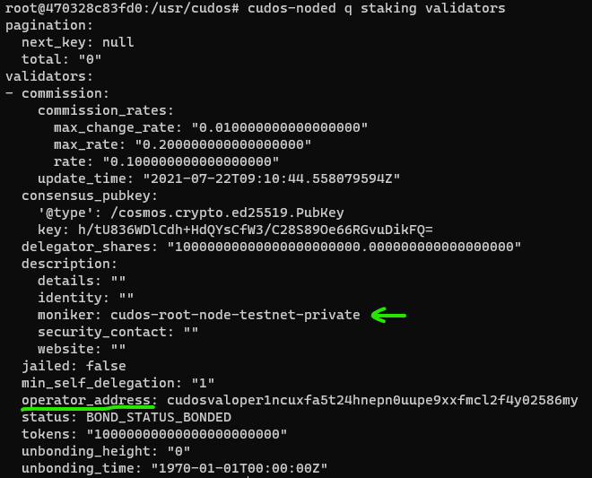
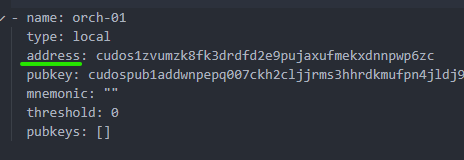

# Create a validator

To create a validator account, you need:
1. A running ethereum full-node
2. A Cudos full-node which is a validator node
3. An orchestrator
4. A gravity bridge

Only after finalizing previous steps, you can start the process of creating a validator and running it on your node. this section explains how to achieve each step in detail.

## Ethereum full-node

You can use either an existing [Ethereum full-node](https://ethereum.org/en/developers/docs/nodes-and-clients/#full-node) (if you have one) or you can follow the procedure below to start one but make sure not to use Infura:

1. Run your ethereum binary on a different machine that your validator is running
2. Clone the correct branche from the [CudosBuilders](https://github.com/CudoVentures/cudos-builders) repository with renaming the folders accordingly to exactly _CudosBuilders_:
```
git clone --depth 1 --branch sdk-0.43  https://github.com/CudoVentures/cudos-builders.git CudosBuilders
```
3. Open shell, navigate to the directory _CudosBuilders/docker/ethereum_ and start the Ethereum full-node by running the command:
```
cd CudosBuilders/docker/ethereum && sudo docker-compose -f ethereum-full.yml -p ethereum up --build --detach
```

Note that you have to wait ~12 hours to finish syncing the Rinkeby test network. Its size is almost 70GB. You can see the logs by running the command:
```
sudo docker logs -f ethereum
```

## Cudos validator node

Make sure that you are [running Cudos full-node as a validator](/docs/build-and-earn/testnet-guides/run-full-node#initialize-the-node-as-a-validator)

Access the container, that is needed to connect to its bash, directly with its name by running the command:
```
sudo docker exec -it cudos-start-full-node-client-testnet-public-01 bash
```

1. As a first step, you need to get the private key of your node. So, if you created the account by Keplr then just connect to the full nodes' container and run the following commands to add it to the node:
```
# The amount you want to stake, denominate them in acudos, without spaces (min 1 000 000 000 000 000 000 acudos) export
export STAKE="1000000000000000000acudos"
export CHAIN_ID="cudos-testnet-public"

# Add the wallet in your nodes' keyring:
cudos-noded keys add validator --recover --keyring-backend="os"
```
2. Enter your mnemonic address for the account, your account should hold at least 1000000000000000000acudos (1 CUDOS).
3. Create a password, which will be used to lock the internal Keystore
4. Re-enter the password
5. You can change the rates as you desire for your validator
6. Create a validator by entering the password and running the following command (change the rates with the ones you want for your validator):
```
cudos-noded tx staking create-validator --amount=$STAKE \
    --from=validator \
    --pubkey=$(cudos-noded tendermint show-validator) \
    --moniker=$MONIKER \
    --chain-id=$CHAIN_ID \
    --commission-rate="0.10" \
    --commission-max-rate="0.20" \
    --commission-max-change-rate="0.01" \
    --min-self-delegation="1" \
    --gas="auto" \
    --gas-prices="0.025acudos" \
    --gas-adjustment="1.80" \
    --keyring-backend="os" \
    -y
```
7. If you see the transaction hash without getting any error, then congrats you have successfully created a validator account.

Note that if you get a message that the transaction is not included in any block, please wait a few seconds and do not start another transaction.

:::tip
Be aware not to exit the docker shell. You will need it for the next step that is registering the Cosmos orchestrator.
:::

## Cosmos orchestrator

The cosmos orchestrator is a program that runs on every validator beside the Cosmos code. Validators, running a chain with the Gravity module installed, use the cosmos orchestrator to sign messages or transactions with a validator's unique key.

### Get the validator address

After you have created a validator account, you must find your validator address by running the command:
```
cudos-noded q staking validators
```

the resulting output looks similar to the picture below, you need to find your validator, you can refer to the moniker to find it, and copy its **operator_address**:


### Add the orchestrator wallet

Now you need to add another wallet to use for the orchestrator but first make sure that **it has some CUDOS tokens**. You can achieve that by running the command:
```
cudos-noded keys add orchestrator --recover --keyring-backend="os"
```

:::tip
Note that after running the command above, you will need to enter both your mnemonic address for the account and the password which you have created on a previous step while adding the validator's wallet.
:::

The resulting output looks similar to the picture below. You will need the address of this wallet and mnemonic for the next steps.



### Register orchestrator

1. Add the following variables:
```
export VALIDATOR_ADDRESS="<*operator_address* from above>"
export ORCH_ADDRESS="<*address* from the previous step>"
export ETH_ADDRESS="<eth address, starting with 0x, that have some ETH on rinkeby test network>"
```
2. Register the orchestrator:
```
cudos-noded tx gravity set-orchestrator-address $VALIDATOR_ADDRESS $ORCH_ADDRESS $ETH_ADDRESS --from validator --keyring-backend "os" --chain-id $CHAIN_ID
```

## Gravity bridge

Make sure to run your gravity bridge binary on the same machine that your validator node is running on.
1. Open shell and navigate to the directory _CudosBuilders/docker/orchestrator_
2. Create a copy of **orchestrator.env.example**
3. Rename it to **orchestrator.client.testnet.public01.env**
4. Open the file _orchestrator.client.testnet.public01.env_ in any editor and set all of the parameters.
5. Delete any comments from this file (delete # and everything after it), the parameter **GRPC** is the port value of the Sentry node.
```
ADDRESS_PREFIX="cudos" # ADDRESS_PREFIX must be exactly as here
FEES="<fee that you will have to pay for each bridge operation>" # format "100acudos"
GRPC="http://<ip of your cosmos node>:9090" # port should be 9090
ETHRPC="http://<ip of ethereum node>:8545" # port should be 8545
CONTRACT_ADDR="0xb22F2A4c231e69703FC524Eb2E3eb7B83C316F42" # CONTRACT_ADDR must be exactly as here
COSMOS_ORCH_MNEMONIC="<mnemonic of your orchestrator account>"
ETH_PRIV_KEY_HEX="<private key of your eth wallet that was used to register the validator>" # in hex format without leading 0x
```
6. Finally run the orchestrator
```
sudo docker-compose --env-file orchestrator.client.testnet.public01.arg -f orchestrator.release.yml -p cudos-orchestrator-client-testnet-public-01-release up --build --detach
```

you can see the logs by running the command:
```
sudo docker logs -f cudos-orchestrator-client-testnet-public-01-release
```

### Send funds using the bridge

You have two different options to send funds (it is recommended to use the first option UI):
1. Using gravity bridge UI
2. Using the console

#### Using the gravity bridge UI (recommended option)

Open [Gravity Bridge](http://35.192.177.142:4000/). Then you can use [Kelpr](https://wallet.keplr.app/) and [Metamask](https://metamask.io/) for sending funds between the two blockchains.

#### Using the console (not recommended option)

1. Start docker shell once again, like you did when you have created your validator.
2. Connect to the orchestrator instance instead of the validator one.
3. Choose how you want to send funds eithrer from Ethereum to Cosmos or the opposite
4. Before sending funds to Ethereum please check the available balance in the smart contract on the address.
5. Send funds from Ethereum to Cosmos by running the command:
```
./gbt client eth-to-cosmos \
  --ethereum-key "<private key of the sender in hex without leading 0x>" \
  --gravity-contract-address "0x9fdE6D55dDa637806DbF016a03B6970613630333" \
  --amount <amount in CUDOS without ""> \ #example 0.000000000000000001
  --destination "<destination cosmos address>" \
  --token-contract-address "0x28ea52f3ee46cac5a72f72e8b3a387c0291d586d" \
  --ethereum-rpc "http://<ip of your ethereum node>:8545"
```
6. Send funds from Cosmos to Ethereum by running the command:
```
./gbt --address-prefix="cudos" client cosmos-to-eth \
    --amount="<amount in acudos>" \ # example "1acudos"
    --cosmos-grpc="http://<ip of your cosmos node>:9090" \
    --cosmos-phrase="<mnemonic of sender>" \
    --eth-destination="<destination eth address>" \
    --fees="<fee that will be kept in the bridged>"
```

Note that The commands of sending funds takes up to few minutes to be executed.
